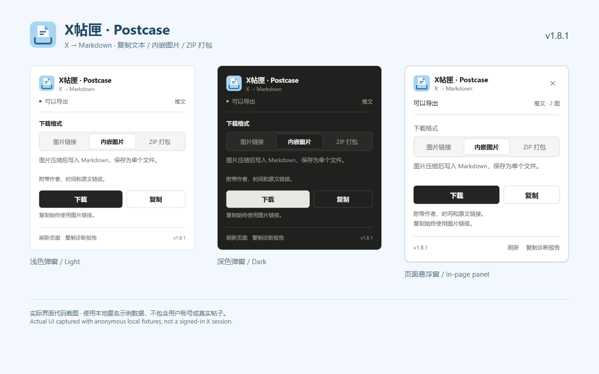

# Postcase · X帖匣 — Save X content as Markdown

[简体中文](README.md) | [English](README.en.md)

Postcase is a Chrome and Edge extension that saves loaded content from X (Twitter) posts, same-author threads, and article detail pages as Markdown. It organizes text, images, quotes, and source metadata locally in your browser. Copy text, download one file, or create a ZIP without a backend service.

Previously X Markdown Exporter, it retains the repository URL, extension identity, package-name prefix, and compatibility with existing settings. **v1.8.1 is published on GitHub.** Store and GitHub installations are separate channels; check each listing for its version.

[GitHub download](https://github.com/rowanjove/x-markdown-exporter/releases/tag/v1.8.1) · [Chrome Web Store](https://chromewebstore.google.com/detail/x-markdown-exporter/alicknocngkldhijfocddaepnfpgjlee) · [Changelog](CHANGELOG.md) · [Issues](https://github.com/rowanjove/x-markdown-exporter/issues)



Screenshots use local anonymous fixtures, not user content. v1.8.1 fixes the store-upload description length and adds per-locale preflight checks; export behavior and saved settings are unchanged.

## Installation

### Chrome Web Store

Open the store link above and follow the browser prompts. The store may show the old name or a different version; that does not mean the GitHub version is unpublished.

### GitHub package

1. Download `x-markdown-exporter-v1.8.1.zip` from the v1.8.1 Release and extract it to a permanent directory.
2. Open `chrome://extensions/` or `edge://extensions/` and enable Developer mode.
3. Choose Load unpacked and select the directory containing `manifest.json`.

To upgrade, back up the old directory, extract the new package into that same directory, reload the extension, and refresh X pages. Do not remove the extension first; keeping the extension ID and directory preserves existing settings. A GitHub ZIP does not automatically update a store-installed extension.

You can also clone and load the repository directory:

```bash
git clone https://github.com/rowanjove/x-markdown-exporter.git
cd x-markdown-exporter
```

## Usage and formats

1. Open a specific post or article (Note) detail page and wait for content to load.
2. Open the draggable floating launcher or the toolbar popup.
3. Select a download format, then choose Copy or Download.
4. Inspect progress or cancel during export. Reopen a closed popup to view the current task.

**Copy always uses image links. The format selector only affects downloads.**

| Format | Output | Use case |
| --- | --- | --- |
| `link` | Markdown with remote image URLs | Quick copying, quoting, and smaller files |
| `embed` | Compressed Base64 images in a single Markdown file | Single-file storage; check that your reader supports data URLs |
| `zip` | Markdown and separate images in a ZIP archive | Offline archives and independent image files |

Oversized embedded files can switch to ZIP. Failed image fetches may leave remote links, so check media completeness after archiving.


## Features and limitations

- Preserve text, image, quote, and link-card order through a structured document model.
- Include author, publication time, and source metadata by default.
- Same-author thread export requires loaded posts and explicit reply or thread context; complete conversation coverage is not guaranteed.
- Timeline, search, and profile pages are not direct export targets. Open a specific post first.
- Extraction rules may need updates when X changes its page structure.
- Complex tables, mathematical formulas, editor-specific nodes, and unusual mixed containers are not guaranteed to retain full fidelity.
- Each `embed`/`zip` export is limited to **500 unique images and 64 MiB of cumulative media data**, with explicit failure when exceeded.
- Image-transcoding canvases are limited to **8 MP**; this is not a memory cap for the whole browser process.
- The background worker fetches at most **6 images concurrently** across tabs, with up to **96 queued requests**. A full queue leaves remote links.
- Navigation or tab closure cleans up related fetch tasks.
- The interface, progress messages, and Markdown metadata support Simplified Chinese and English. Browser peak memory and real-page queue waiting times still require further measurement.

See the [code review](CODE_REVIEW.md) and [improvement plan](IMPROVEMENT_PLAN.md) for reproductions, fixes, and remaining work.

## Privacy and network access

Post content is not uploaded to third-party processing servers, and no external backend is required. The extension background worker fetches images from allowed X/Twitter asset URLs; local processing does not let it download unfetched media while offline. Diagnostics remain local and are not automatically uploaded as telemetry.

See [PRIVACY.md](PRIVACY.md). Respect authors' rights and platform rules when saving or redistributing content.

## Development and verification

Requires Node.js **>=20**. The unpacked extension has no build step, but tests require development dependencies:

```bash
npm ci
npm run check
npx playwright install chromium
npm run check:all
```

The full suite includes unit tests, Playwright page fixtures, real MV3 installation/injection/download/service-worker tests, and release consistency checks.

| Command | Purpose |
| --- | --- |
| `npm run verify:release` | Validate release metadata and existing artifacts |
| `npm run package` | Create a release directory, ZIP, and SHA-256 file in `dist/` without overwriting existing artifacts |
| `npm run fixture` | Start the local UI fixture |
| `npm run screenshots` | Recapture anonymous example screenshots |

The fixture runs at `http://127.0.0.1:4173/`. The popup preview is at `/__fixture__/popup.html?lang=en&theme=light`; change the theme to `dark` as needed. It uses simulated extension APIs and does not copy or download. Real extension behavior is verified separately by MV3 tests.

Key modules are `content-core.js` (extraction), `content-export.js` (rendering and media), `content-ui.js` (floating interface), `content.js` (orchestration), `background.js` (image fetching), and `popup.js` (toolbar entry). Reload the extension and refresh X pages after changes.

## Branding and license

See [BRAND.md](BRAND.md) for naming, colors, and icons. Code is licensed under the [MIT License](LICENSE).
