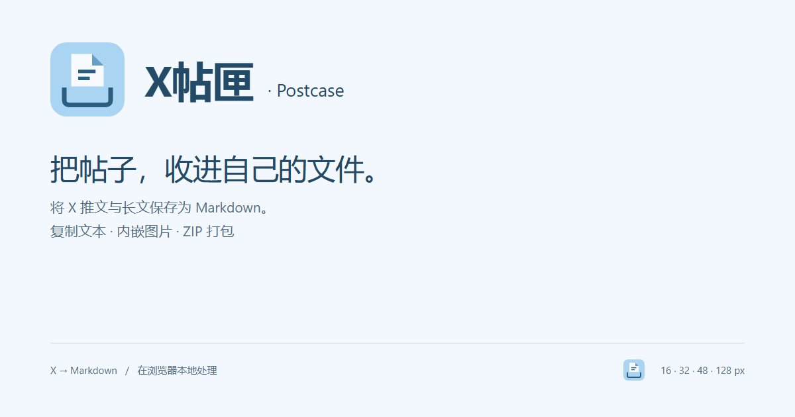

# X Markdown Exporter



[中文](#chinese) | [English](#english)

X Markdown Exporter 是一款 Chrome / Edge 扩展，可将 X（Twitter）推文、线程和长文 Note 复制或归档为 Markdown，方便投喂 AI 工具和整理本地知识库。

English: Copy and archive X (Twitter) posts, threads, and long-form Notes as Markdown for AI tools and local knowledge workflows.

[Chrome Web Store](https://chromewebstore.google.com/detail/x-markdown-exporter/alicknocngkldhijfocddaepnfpgjlee) | [GitHub Releases](https://github.com/rowanjove/x-markdown-exporter/releases)

## 最新更新 / Latest Update

### v1.7.0

- 新增英文和简体中文本地化，覆盖弹窗、悬浮面板、进度提示、文件名和 Markdown 元数据
- 使用结构化文档模型重构推文、线程、图片、外链卡片和引用推文提取
- 新增图片并发控制、导出进度、取消操作、本地诊断和部分导出警告
- 新增单元测试、真实浏览器测试、MV3 打包扩展测试和可复现发布校验

English summary: localization, safer structured extraction, cancellable image exports, diagnostics, and comprehensive release automation.

## 预览 / Preview

### 导出示例 / Export Example


<a id="chinese"></a>

## 中文

### 这是什么

这是一个把 X / Twitter 推文、线程和 Note 转成 Markdown 的浏览器扩展。它的核心定位很直接：当你想把一些推特内容喂给 OpenClaw、Claude Code、Claude、ChatGPT 等工具时，不必和网页反爬、复制断行、图片链接丢失这些细碎问题纠缠，直接复制一份结构清晰的 Markdown 就能作为上下文使用。

它也适合本地归档。很多长文、线程和高质量推文值得保存到 Obsidian、Notion、本地知识库或项目资料夹里，X Markdown Exporter 可以把正文、图片、引用推文、外链卡片和来源信息尽量整理成更耐用的 Markdown。

### 亮点

- 支持 X / Twitter 推文详情页和 Note 页面导出
- 页面内右侧悬浮按钮，支持横向和纵向拖动，自动记住位置
- 点击后弹出小面板，直接选择导出模式
- 一键复制 Markdown 文本，适合快速投喂给 OpenClaw、Claude Code 等工具
- 可在面板状态旁显示推文、文章、线程、图片数量、引用推文和外链卡片等内容标签
- 保留正文和图片的原始顺序
- 使用结构化内容模型保存文本、链接、图片、引用和卡片顺序，避免字符串占位符碰撞
- 支持同作者线程连续导出
- 支持外链预览卡提取，导出时会尽量保留链接标题、摘要和域名
- 支持三种导出模式
- 默认附带作者和发布时间
- 时间线、搜索页、主页等不支持直接导出的页面会给出更明确的下一步提示
- 根据浏览器语言提供英文或简体中文界面、进度提示与 Markdown 元数据标签
- 图片归档使用受控并发，并可在悬浮面板或扩展弹窗中查看进度和取消导出
- 所有处理都在本地浏览器完成，不依赖后端服务

### 典型场景

- 把一条推文、一个线程或一篇 Note 复制成 Markdown，直接粘贴给 OpenClaw、Claude Code 或其他 AI 编程/研究工具分析
- 绕过网页端反爬和复制体验限制，把 X 内容稳定地转成文本上下文
- 把高质量文章、教程、观点线程保存到 Obsidian、Notion、Logseq 或本地资料夹
- 将带图片、引用推文和外链卡片的内容整理成更适合二次阅读和检索的 Markdown

### 导出模式

#### `link`

Markdown 中保留远程图片地址，并尽量把链接卡片转成普通 Markdown 链接。

适合：

- 点击 `复制` 时的默认文本形态
- 快速投喂给 AI 工具
- 文件体积最小
- 在线阅读或二次整理

#### `embed`

图片压缩后以内嵌 Base64 的形式写入单个 Markdown 文件。

适合：

- 想保留单文件
- 导入 Obsidian、Notion 或本地知识库

#### `zip`

Markdown 和图片分开保存，再打包成 ZIP。

适合：

- 完整离线归档
- 希望 Markdown 正文更清爽

### 安装

#### 方式一：从 Chrome 网上应用店安装

1. 打开 [X Markdown Exporter - Chrome 网上应用店](https://chromewebstore.google.com/detail/x-markdown-exporter/alicknocngkldhijfocddaepnfpgjlee)
2. 点击 `添加至 Chrome`
3. 按浏览器提示确认安装

#### 方式二：从 GitHub Releases 下载

1. 打开 [Releases](https://github.com/rowanjove/x-markdown-exporter/releases)
2. 下载最新版本里的 `x-markdown-exporter-v1.7.0.zip`
3. 解压 ZIP 文件
4. 打开扩展管理页
   Chrome: `chrome://extensions/`
   Edge: `edge://extensions/`
5. 开启“开发者模式”
6. 点击“加载已解压的扩展程序”
7. 选择解压后的目录

#### 方式三：直接克隆仓库

```bash
git clone https://github.com/rowanjove/x-markdown-exporter.git
```

然后同样在浏览器扩展管理页加载仓库目录。

### 使用方法

1. 打开一条 X 推文详情页或一篇 X Note 页面
2. 在页面右侧找到悬浮按钮
3. 如果挡住内容，可以直接拖到更合适的位置
4. 点开面板后选择导出模式
5. 点击 `复制` 直接获取 Markdown 文本，或点击 `下载` 保存文件

工具栏里的扩展弹窗仍然保留，作为备用入口。

### 项目结构

```text
.
├─ manifest.json
├─ popup.html
├─ popup.js
├─ content.js
├─ content-core.js
├─ content-export.js
├─ content-ui.js
├─ content.css
├─ background.js
├─ jszip.min.js
├─ package.json
├─ IMPROVEMENT_PLAN.md
├─ scripts/
├─ tests/
├─ icons/
├─ assets/
└─ dist/
```

### 技术说明

- `content.js`
  - 作为内容脚本入口
  - 负责消息监听、导出编排和模块初始化
- `content-core.js`
  - 处理正文、图片、线程、引用推文和链接卡片提取
  - 负责标题和文件名生成
- `content-export.js`
  - 负责 Markdown 组装、图片压缩和三种下载模式
- `content-ui.js`
  - 负责悬浮按钮、面板、拖动交互和页面状态管理
- `content.css`
  - 定义悬浮按钮、弹层和提示样式
- `background.js`
  - 负责跨域抓取图片
  - 为 `embed` 和 `zip` 模式提供 Base64 数据
- `popup.js`
  - 保留工具栏备用入口

### 已知限制

- 主要面向推文详情页和 Note 页面，时间线、搜索页和主页不会直接导出；请先点开具体推文或 Note
- 如果 X 调整 DOM 结构，提取规则可能需要跟进
- 大多数外链预览卡可以提取，但极个别复杂卡片仍可能不完整

### 隐私说明

- 不上传内容到第三方服务器
- 不依赖除 X / Twitter 资源之外的外部服务
- 图片仅通过扩展后台从官方资源地址获取

### 本地开发

项目没有构建步骤。

质量检查：

```bash
npm run check
```

运行完整检查（包括 Playwright 页面 fixture 和真实 MV3 扩展安装、注入、下载、Service Worker 测试）：

```bash
npm run check:all
```

仅校验版本和 CHANGELOG 等发布元数据：

```bash
npm run verify:release
```

在不覆盖已有发布物的情况下，在 `dist/` 生成发布目录和 ZIP：

```bash
npm run package
```

打包过程会逐文件验证 ZIP，并生成对应的 `.zip.sha256` 校验文件。

完整改进路线见 [IMPROVEMENT_PLAN.md](IMPROVEMENT_PLAN.md)。

启动真实浏览器 UI fixture：

```bash
npm run fixture
```

然后打开 `http://127.0.0.1:4173/`，验证悬浮面板、复制和下载交互。

本地测试：

1. 修改仓库文件
2. 打开浏览器扩展管理页
3. 点击“重新加载”
4. 回到 X 页面刷新并测试

<a id="english"></a>

## English

### What It Does

X Markdown Exporter turns X / Twitter posts, threads, and long-form Notes into Markdown. Its main job is practical: when you need to feed Twitter/X content into OpenClaw, Claude Code, Claude, ChatGPT, or another coding and research tool, you can copy clean Markdown directly instead of fighting page anti-scraping behavior, broken selection, or messy formatting.

It is also useful for archiving. Good posts, threads, and long-form Notes often deserve a durable local copy. X Markdown Exporter keeps the text, images, quoted posts, link cards, and source metadata in a format that works well in Obsidian, Notion, local folders, and knowledge-base workflows.

### Highlights

- Export X / Twitter post detail pages and Note pages
- Draggable in-page floating launcher with saved position
- Open a compact export panel directly on the page
- Copy Markdown text with one click for fast AI-context handoff to OpenClaw, Claude Code, and similar tools
- Show content labels for posts, articles, threads, image counts, quoted posts, and link cards
- Preserve the original order of text and images
- Keep text, links, images, quotes, and cards in a structured document model instead of indexed string placeholders
- Export same-author thread continuations
- Convert supported link preview cards into Markdown links with title / summary / domain
- Support `link`, `embed`, and `zip` output modes
- Include author, publish time, and `source_url` by default
- Guard oversized `embed` exports by offering a ZIP fallback
- Give clearer next-step guidance on timeline, search, profile, explore, and still-loading pages
- Localize the interface, progress messages, filenames, and Markdown metadata for English and Simplified Chinese browser locales
- Fetch archive images with bounded concurrency and expose progress plus cancellation in both extension interfaces
- Run fully in the browser with no backend service

### Common Workflows

- Copy a post, thread, or Note as Markdown and paste it into OpenClaw, Claude Code, or another AI coding/research tool
- Turn X content into stable text context without relying on brittle page scraping or manual selection
- Archive high-quality articles, tutorials, and opinion threads into Obsidian, Notion, Logseq, or local folders
- Preserve content with images, quoted posts, and external link cards in a cleaner Markdown shape for later reading and search

### Export Modes

#### `link`

Keep remote image URLs in Markdown and preserve supported external preview cards as Markdown links.

Best for:

- the default text shape used by `Copy`
- quickly feeding AI tools
- the smallest file size
- online reading or lightweight notes

#### `embed`

Compress images and embed them as Base64 in a single Markdown file. Oversized exports warn first and can fall back to ZIP automatically.

Best for:

- a single self-contained file
- importing into Obsidian, Notion, or local knowledge bases

#### `zip`

Store Markdown and images separately, then package them into a ZIP archive.

Best for:

- full offline archiving
- keeping the Markdown body cleaner

### Installation

#### Option 1: Install from the Chrome Web Store

1. Open [X Markdown Exporter on the Chrome Web Store](https://chromewebstore.google.com/detail/x-markdown-exporter/alicknocngkldhijfocddaepnfpgjlee)
2. Click `Add to Chrome`
3. Confirm the browser prompt

#### Option 2: Download from GitHub Releases

1. Open [Releases](https://github.com/rowanjove/x-markdown-exporter/releases)
2. Download `x-markdown-exporter-v1.7.0.zip`
3. Extract the ZIP file
4. Open the extensions page
   Chrome: `chrome://extensions/`
   Edge: `edge://extensions/`
5. Enable Developer Mode
6. Click `Load unpacked`
7. Select the extracted folder

#### Option 3: Clone the Repository

```bash
git clone https://github.com/rowanjove/x-markdown-exporter.git
```

Then load the repository folder as an unpacked extension.

### Usage

1. Open an X post detail page or a Note page
2. Find the floating launcher on the right side
3. Drag it away if it overlaps the content
4. Open the panel and choose an export mode
5. Click `Copy` for Markdown text, or `Download` to save a file

The toolbar popup is still available as a fallback entry point.

### Project Structure

```text
.
├─ manifest.json
├─ popup.html
├─ popup.js
├─ content.js
├─ content-core.js
├─ content-export.js
├─ content-ui.js
├─ content.css
├─ background.js
├─ jszip.min.js
├─ icons/
├─ assets/
└─ dist/
```

### Technical Notes

- `content.js`
  - acts as the content-script entry point
  - wires message handling, export orchestration, and module bootstrap
- `content-core.js`
  - extracts text, images, same-author threads, quoted tweets, and supported link preview cards
  - generates titles and filenames
- `content-export.js`
  - assembles Markdown, compresses images, and handles all download modes
- `content-ui.js`
  - manages the floating launcher, panel UI, dragging, and page readiness state
- `content.css`
  - styles the floating launcher, panel, and toasts
- `background.js`
  - fetches cross-origin images
  - provides Base64 payloads for `embed` and `zip`
- `popup.js`
  - keeps the toolbar popup as a fallback

### Known Limitations

- The extension is designed for post detail pages and Note pages. Timeline, search, and profile pages are guidance-only entry points; open a specific post or Note before exporting
- If X changes its DOM structure significantly, the extraction rules may need updates, but empty exports now fail with a clearer warning instead of silently saving a blank file
- Most preview cards are handled, but a few complex cards may still be incomplete

### Privacy

- No content is uploaded to third-party servers
- No external backend service is required
- Images are fetched only from official X / Twitter asset URLs through the extension background worker

### Development

There is no build step.

Run the syntax and regression checks:

```bash
npm run check
```

Run the complete suite, including the Playwright page fixture and a real MV3 extension install, injection, download, and service-worker test:

```bash
npm run check:all
```

Validate release metadata without creating artifacts:

```bash
npm run verify:release
```

Create a release directory and ZIP in `dist/` without overwriting existing artifacts:

```bash
npm run package
```

Packaging now verifies every ZIP entry and writes a matching `.zip.sha256` sidecar.

See [IMPROVEMENT_PLAN.md](IMPROVEMENT_PLAN.md) for the implementation roadmap.

Start the real-browser UI fixture:

```bash
npm run fixture
```

Then open `http://127.0.0.1:4173/` to verify the floating panel, copy, and download flows.

To test local changes:

1. Edit the repository files
2. Open the browser extensions page
3. Click `Reload`
4. Refresh an X page and test again

## License

[MIT](LICENSE)
